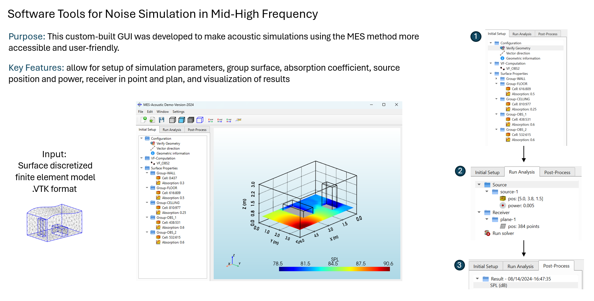

# MES-Acoustic

MES-Acoustic is a Windows desktop application for room-acoustic simulation
using the radiative energy transfer (RET) method.

It provides a PySide6 GUI for preparing Gmsh surface meshes, assigning
absorption by Physical Surface ID, computing view factors, defining point and
plane receivers, solving sound-pressure levels, and visualizing results with
PyVista.



_Interface and workflow overview from MES-Acoustic v0.1. The current
development version retains the same Initial Setup, Run Analysis, and
Post-Process workflow._

## Features

- Import Gmsh `.msh` surface meshes with Physical Surface IDs
- Retain `.vtk` and `.vtu` import support for backward compatibility
- Read Gmsh Physical Surface IDs and names
- Detect and correct surface-normal direction automatically
- Assign absorption coefficients to one or more Physical Surfaces
- Compute or load NumPy view-factor matrices
- Define multiple point sources
- Define point receivers and standard XY, XZ, or YZ receiver planes
- Select which receiver groups to run
- Display solver and view-factor progress in the GUI
- Visualize SPL contours with PyVista
- Save and load project configuration as JSON

## Download

Windows installers are published on the
[GitHub Releases](https://github.com/twanglom/MES-Acoustic-Software/releases)
page.

The current installer is approximately 150 MB. The installed application is
approximately 600 MB because it includes Python, Qt, VTK, NumPy, SciPy, Numba,
and the required native runtime libraries.

Do not download the automatically generated "Source code" archive if you only
want to run the application. Download the file named similar to:

```text
MES-Acoustic-0.1.0-Windows-x64-Setup.exe
```

## Documentation

- [Installation](docs/installation.md)
- [User guide](docs/user-guide.md)
- [Development guide](docs/development.md)
- [Publishing a release](docs/releasing.md)
- [Contributing](CONTRIBUTING.md)

## Quick Start From Source

Requires 64-bit Windows and Python 3.11.

```powershell
python -m venv .venv
.\.venv\Scripts\Activate.ps1
python -m pip install --upgrade pip
python -m pip install -r requirements.txt
python main_run.py
```

## Project Data

Generated view-factor matrices, saved projects, and simulation results are
intentionally excluded from the repository and installer.

The complete GUI source, RET core, PyInstaller configuration, and Inno Setup
configuration are included in this repository. A pre-built Windows GUI is
available from [GitHub Releases](https://github.com/twanglom/MES-Acoustic-Software/releases).

Two Gmsh test meshes with Physical Surface IDs are included:

- [`geo/room.msh`](geo/room.msh): room with wall, floor, ceiling, and obstacle
  surface groups
- [`geo/a320.msh`](geo/a320.msh): A320 cabin surface model with cabin material
  groups

The legacy VTK examples were removed because they do not contain the Physical
Surface IDs required by the current material-assignment workflow. Generated
`.npy`, `.vtk`, and `.vtu` result files remain ignored.

## Reference

Wanglomklang, T., Gillot, F., and Besset, S. (2024). "An intersection
interaction hybrid method for energy flow at mid-high frequency for complex
cavities acoustic." Proceedings of the 9th European Congress on Computational
Methods in Applied Sciences and Engineering (ECCOMAS Congress 2024), Lisboa,
Portugal, June 3-7, 2024.

## License

MES-Acoustic source code is released under the [MIT License](LICENSE).
Third-party libraries and binary dependencies remain under their respective
licenses.
